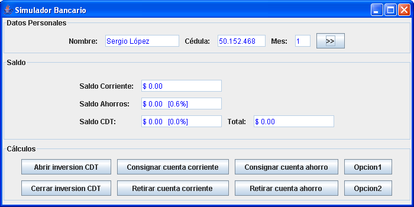

# Descripción

## Enunciado

Una de las actividades más comunes en el mundo financiero, es la realización de
simulaciones que permitan a los clientes saber el rendimiento de sus productos
a través del tiempo, contemplando diferentes escenarios y posibles situaciones
que se presenten.

Se quiere crear un programa que haga la simulación en el tiempo de la cuenta
bancaria de un cliente.
Un cliente tiene un nombre y un número de cédula el cualidentifica la cuenta.
Una cuenta, por su parte está constituida por tres productos
financieros básicos: (1) una cuenta de ahorro, (2) una cuenta corriente
y (3) un certificado de depósito a término CDT. Estos productos son independientes
y tienen comportamientos particulares.

El saldo total de la cuenta es la suma de lo que el cliente tiene en cada uno
de dichos productos. En la cuenta corriente el cliente puede depositar o retirar
dinero.
Su principal característica es que no recibe ningún interés por el dinero que
se encuentre allí depositado. En la cuenta de ahorro, se paga un interés mensual
del 0.6% sobre el saldo.
Cuando el cliente abre un CDT, define la cantidad de dinero que quiere invertir
y negocia con el banco el interés mensual que va a recibir. A diferencia de la
cuenta corriente o la cuenta de ahorro, en un CDT no se puede consignar ni retirar
dinero. La única operación posible es cerrarlo, en cuyo caso, el dinero y sus
intereses pasan a la cuenta corriente.

Se quiere que el programa permita a una persona simular el manejo de sus
productos bancarios, dándole las facilidades de: (1) hacer las operaciones
necesarias sobre los productos que conforman la cuenta, y (2) avanzar mes por mes
en el tiempo, para que el cliente pueda ver el resultado de sus movimientos
bancarios y el rendimiento de sus inversiones.

## Interfaz

